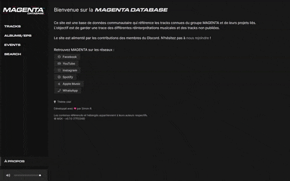
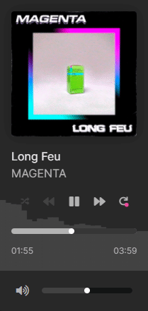
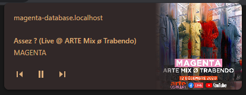
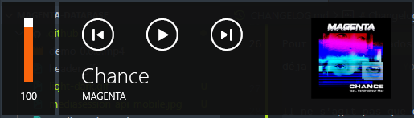

# Changelog

Toutes les modifications notables apportées à ce projet seront documentées dans ce fichier.

Le format est basé sur [Keep a Changelog](https://keepachangelog.com/fr/1.0.0/),
et ce projet adhère au [Semantic Versioning](https://semver.org/spec/v2.0.0.html).

## [Unreleased]

## [0.8.0] - 2020-12-20

### 📱 Responsive !

Le site est désormais entièrement compatible avec les résolutions mobiles ! La sidebar et le player ont été retravaillés pour s'adapter à presque toutes les tailles d'écran, les affichages tableaux/grilles également.

Vu que j'ai implémenté le `MediaSessionAPI` au sein de la dernière version, ça nous offre cette belle notification intégrée au système lors de la lecture :

Pour les téléphones qui le supportent, vous pouvez donc minimiser le navigateur et changer directement de track via la notification. Ça fonctionne aussi si vous avez un casque ou des écouteurs avec une télécommande !

Je suis assez fier de cette version mobile, c'est un peu ce qui manquait pour terminer cette v1 !

### 💡 Thème clair

Pour les afficionados des fonds blacs, un thème clair à été ajouté en plus du thème sombre déja présent.

Il ne s'agit pas que d'une simple inversion des couleurs ! Pour rester lisible, cohérent et agréable, l'affichage sur fond blanc doit être nettement plus contrasté; Chaque placement de couleur placée doit donc être réfléchie.

Pour changer de thème c'est sur la page d'accueil, juste en dessous des liens sociaux. Par défaut, le thème séléctionné sera celui du système.

### Autres

* Correction d'un bug de sur la fonction loop lorsqu'on jouait qu'une seule track sans contexte (ex: depuis le tableau des fichiers)
* Uniformisation des marges de séparation de contenu
* Trucs techniques qui n'intéressent personne

## [0.7.0] - 2020-12-18

### Amélioration du lecteur

Le player propose désormais les fonctionnalités standard de piste précédente et piste suivante. J'ai aussi ajouté deux fonctionnalités: la lecture aléatoire et la lecture en boucle.

Pour implémenter la lecture aléatoire j'avais plusieurs choix de fonctionnement, à savoir :

* Le mode *shuffle*, qui mélange la file d'attente de lecture une fois pour toutes
* Le mode *pick random*, qui prends une musique aléatoire dans la file d'attente et qui la joue
* Le mode *pick random and ignore*, qui prends une musique aléatoire dans la file d'attente et qui l'ignore ensuite pour ne plus la rejouer

J'ai choisi la seconde solution, qui était la plus simple à implémenter et qui permet d'avoir virtuellement une liste de lecture infinie.

#### File d'attente

Avant disponible uniquement lors de la lecture d'albums ou d'events, la lecture contextuelle est désormais disponible également dans les listes !

#### MediaSessionAPI

Pour une meilleure intégration avec le navigateur et en vue d'une future déclinaison mobile, j'ai adapté le code pour prendre en charge le `MediaSessionAPI`. C'est celui qui génère des notifications comme ça dans le navigateur :

Actuellement, les `play`, `pause`, `previoustrack` et `nexttrack` sont implémentés.

Ça permet aussi une intégration native au système, comme ça :

### Autres

* Ajout de l'upload de fichiers sur les albums et les events

## [0.6.0] - 2020-12-16

* Regroupement des albums par artiste
* Nouveaux filtres pour les tracks
* Nouveau status "Supprimé" (pour les tracks d'AUTRANS en l'occurance)
* Affichage des sources disponibles en cas de track avec plusieurs fichiers (théoriquement j'ai codé un algo pour séléctionner la meilleure)
* Bouton de téléchargement pour les fichiers et les ziks non publiées

Pour rappel :

> **Publiés**
> Tous les tracks officiels
>
> **Publiés sans album**
> Les tracks officiels qui ne sont pas dans à un album ou présent dans un event
>
> **Inédits**
> Les tracks qui n'ont pas eu de release officielle
>
> **Inédits sans variantes**
> Les tracks qui n'ont pas eu de release et qu'on a entendu qu'une fois
>
> **Supprimés**
> Les tracks qui ont été publiés un jour et qui sont aujourd'hui retirés des plateformes

J'ai aussi modifié un peu l'affichage des pochettes et le comportement du chargement pour que ce soit un peu plus rapide chez les gens qui n'ont pas la fibre :rire:

## [0.5.3] - 2020-12-15

## [0.5.2] - 2020-12-15

## [0.5.1] - 2020-12-15

## 0.1.0 - 2020-12-14

[unreleased]: https://github.com/mgkprod/magenta-database/compare/0.8.0...HEAD

[0.8.0]: https://github.com/mgkprod/magenta-database/compare/0.7.0...0.8.0

[0.7.0]: https://github.com/mgkprod/magenta-database/compare/0.6.0...0.7.0

[0.6.0]: https://github.com/mgkprod/magenta-database/compare/0.5.3...0.6.0

[0.5.3]: https://github.com/mgkprod/magenta-database/compare/0.5.2...0.5.3

[0.5.2]: https://github.com/mgkprod/magenta-database/compare/0.5.1...0.5.2

[0.5.1]: https://github.com/mgkprod/magenta-database/compare/0.5.0...0.5.1

[0.5.0]: https://github.com/mgkprod/magenta-database/compare/0.1.0...0.5.0
